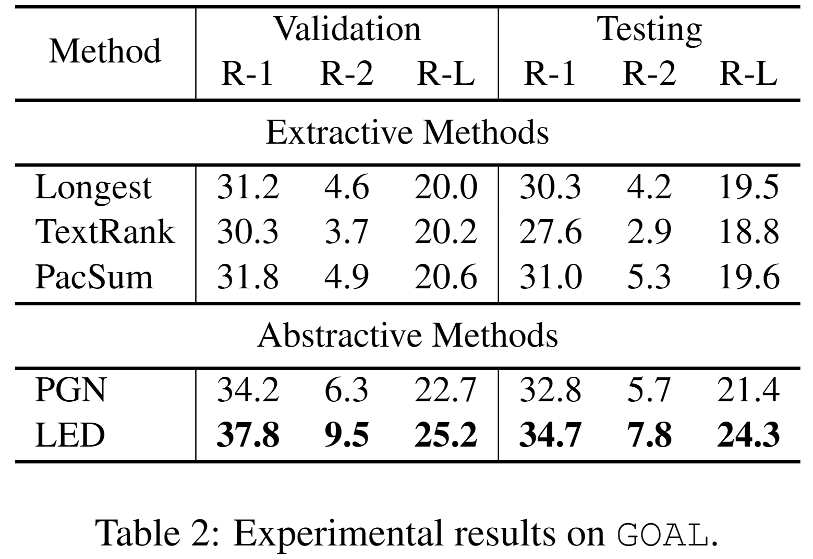

## GOAL: Towards Benchmarking Few-Shot Sports Game Summarization

This repository contains the data and codes for our preprint paper *[GOAL: Towards Benchmarking Few-Shot Sports Game Summarization](https://arxiv.org/abs/2207.08635)* (still a work in progress)


### Data
- `data/goal.json`: 103 labeled samples
- `data/goal_semi.json`: 2,160 unlabeled samples
- `data/goal_Zh.json`: 103 translated sports news

The format of each JSON file is as follows:
```python
[
    {
        "date": "2017-01-22",
        "comp_title": "Serie A",
        "url": {
            "Details": "https://goal.com/en-us/match/juventus-v-lazio/commentary-result/1eucm7a49ntfkms1rhxmfkuzt",
            "Report": "https://goal.com/en-us/match/juventus-v-lazio/report/1eucm7a49ntfkms1rhxmfkuzt"
        },
        "home": "juventus",
        "guest": "lazio",
        "id": 0,
        "data": {
            "commentary": [
                [
                    [], # timeline information (some commentaries do not own this information)
                    "FULL-TIME! Juventus close out a comfortable 2-0 victory against Lazio, with early goals from Dybala and Higuain wrapping up the three points for the Old Lady. The away side lose ground in the hunt for Champions League football, while Juventus remain four points clear at the top of Serie A. That's all that we have time for, we hope to see you again next time." # commentary sentence
                ],
                ...
                [
                    [],
                    "Hello and welcome to live coverage of Juventus' home game in Serie A against Lazio, as Massimiliano Allegri's men look to maintain their pace at the top of the pile. A win for the Old Lady can restore their four-point lead in first place, with their adversaries for the afternoon currently just five points off them in fourth."
                ]
            ],
            "news": [
                "Paulo Dybala and Gonzalo Higuain struck as Juventus got their Serie A title bid back on track with a comfortable 2-0 victory over Lazio in Turin.", # news sentence
                ...
                "Lazio, meanwhile, were unable to test Buffon at all in the closing stages, with Juve substitute Marko Pjaca wasting two good late chances at the other end as his side saw out a low-key second half with surprising ease."
            ]
        }
    },
```

### Codes

<p align="left">
    <br>
    
    <br>
</p>


The reference codes of our baselines are:
- [Summa-textrank](https://pypi.org/project/summa/)
- [PacSum](https://github.com/mswellhao/PacSum)
- [PGN](https://github.com/xcfcode/PLM_annotator/tree/main/pgn)
- [LED](https://github.com/allenai/longformer/blob/master/scripts/summarization.py)


For the hyper-parameters, see Implementation Details (Section 3.2) in our paper.

### Other Useful Resources
- [SportsSum](https://github.com/ej0cl6/SportsSum)
- [SportsSum2.0](https://github.com/krystalan/SportsSum2.0)
- [K-SportsSum](https://github.com/krystalan/K-SportsSum)
